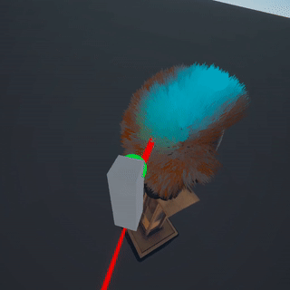

# hair-cut-in-oculus-quest-2

# preview
  

# full preview
https://youtu.be/mXF_oFcQ4Zw

# how it works
- uses vertex color data of the mesh and bakes the hair data.
- creates a compute buffer for GPU instancing.
- batches only one hair blade, renders the required amount of hair blades by reading material instance buffer.

inspired by;
 https://github.com/GeorgeAdamon/ways-to-render-1M-cubes
 https://github.com/KDSBest/Render1MillionObjectsWithUnityAndShaderGraph

used assets:
Head => https://sketchfab.com/3d-models/human-head-926ba74256cf463c920afc1fdc8bc6ae
Stand => https://sketchfab.com/3d-models/book-stand-fb784262748d414fa1ff882a871a5af8
HairDryer => https://sketchfab.com/3d-models/hair-dryer-866d55094bce45dcaa0a0f667920a968

